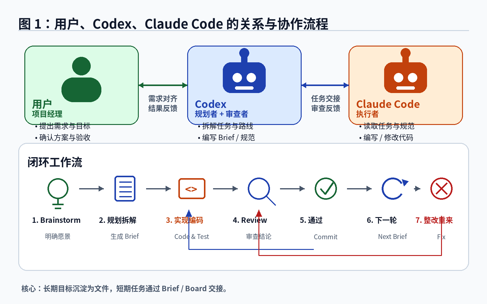
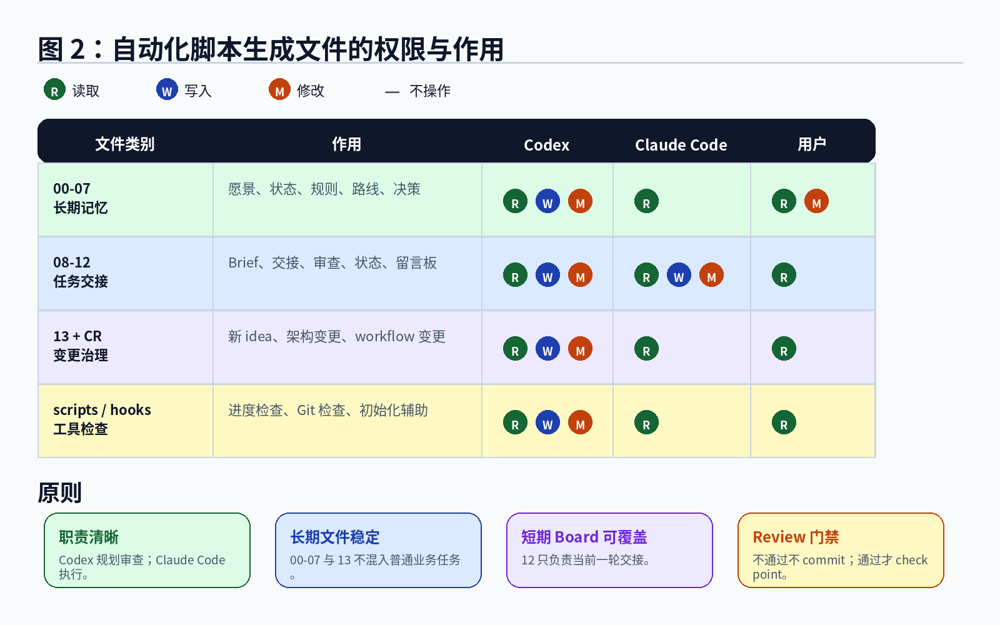

# Dual Agent Project Initializer / 双 Coding Agents 协作项目初始化器

[English](README.md) | [架构说明](docs/ARCHITECTURE.md) | [贡献指南](CONTRIBUTING.zh-CN.md)

一个用于初始化 **双 Coding Agents 协作工作流** 的跨平台项目母板。

用户担任 Product Owner / 项目经理，Codex 担任 Planner / Reviewer / Git Finalizer，Claude Code 担任 Implementer / Fixer。初始化器会生成一套可版本化、可恢复、可复现的文件型工作流，用于项目 brainstorm、长期记忆、任务交接、代码实现、代码审查、Git checkpoint 和 Change Request。

## 图示概览

<p align="center">
  
</p>

<p align="center">
  
</p>

## 为什么需要这个项目

AI Coding Agent 很强，但在真实长期项目中经常出现这些问题：

- 对话上下文容易丢失；
- Agent 忘记最初目标和硬性要求；
- planning、coding、review、Git 操作混在一起；
- 多个 Agent 不知道下一步该谁做；
- 新 idea、架构变更和当前 coding 任务混杂；
- 用户需要反复写很长的提示词。

这个项目把这些不稳定因素沉淀成仓库内的标准工作流文件。

## 角色分工

| 角色 | 工具 / 人 | 主要职责 |
|---|---|---|
| Product Owner / 项目经理 | 使用者 | 提出目标、确认方向、决定重大变更、最终验收 |
| Planner / Reviewer / Git Finalizer | Codex | Brainstorm、架构规划、任务拆解、代码审查、本地 Git checkpoint、下一轮任务规划 |
| Implementer / Fixer | Claude Code | 严格按照当前 Brief 实现代码，修复 Required Fixes，更新交接文档 |

核心原则：

> Codex 负责想清楚和审清楚，Claude Code 负责写代码，用户负责定方向。

## 日常循环

```text
User → Codex
  Codex 写入 / 更新 Implementation Brief 和 Agent Board
      ↓
User → Claude Code
  Claude Code 执行当前任务，写入 Coding Handoff
      ↓
User → Codex
  Codex 执行 One-Shot Review-Finalize-Next
      ↓
  如果不通过：写 Required Fixes，交回 Claude Code，不 commit
  如果通过：本地 commit，不默认 push，准备下一轮 Brief + Board
```

## 极简提示词

给 Claude Code：

```text
请读取 11 和 12，执行当前 Claude Code 任务。
```

给 Codex：

```text
请读取 11 和 12，执行 One-Shot Review-Finalize-Next。
```

新 idea：

```text
请读取 11 和 12，把以下新 idea 作为 Change Request 分析，不改代码。
```

架构变更：

```text
请进入 Architecture Change Mode，读取 11、12、13，对以下架构变更做影响分析，不改业务代码。
```

## 生成文件说明

| 文件 | 作用 |
|---|---|
| `AGENTS.md` | Codex 的长期规则入口，包含 planning、review、Git finalization、One-Shot Review-Finalize-Next |
| `CLAUDE.md` | Claude Code 的长期规则入口，规定 implementation、fixing、handoff |
| `docs/agent/00_PRODUCT_VISION.md` | 项目愿景、边界、长期目标 |
| `docs/agent/01_CURRENT_STATUS.md` | 当前项目状态、已完成、进行中、缺口 |
| `docs/agent/02_LOCKED_REQUIREMENTS.md` | 不可破坏的硬性要求 |
| `docs/agent/03_ROADMAP.md` | 阶段路线图、里程碑、任务列表 |
| `docs/agent/04_TASK_HANDOFF.md` | 当前任务交接 |
| `docs/agent/05_PROGRESS.md` | 进度追踪 |
| `docs/agent/06_DECISION_LOG.md` | 架构、数据、合规、workflow 等重要决策 |
| `docs/agent/07_RECOVERY_PROTOCOL.md` | 中断、断网、忘记轮到谁时如何恢复 |
| `docs/agent/08_IMPLEMENTATION_BRIEF.md` | Codex 给 Claude Code 的具体任务说明 |
| `docs/agent/09_CODING_HANDOFF.md` | Claude Code 完成后写给 Codex 的实现交接 |
| `docs/agent/10_REVIEW_REPORT.md` | Codex 审查报告，明确 PASS / FAIL 和 Required Fixes |
| `docs/agent/11_AGENT_STATE.md` | 当前任务、Phase、Owner、Git 状态、恢复入口 |
| `docs/agent/12_AGENT_BOARD.md` | 当前一轮 Agent 之间的短期留言板 |
| `docs/agent/13_CHANGE_CONTROL.md` | 新 idea、架构变更、workflow/meta 变更的处理协议 |

## 安装与使用

### macOS / Linux

```bash
python3 init-agent-project.py /path/to/your/project
```

或：

```bash
chmod +x init-agent-project.sh
./init-agent-project.sh /path/to/your/project
```

### Windows PowerShell

示例统一使用正斜杠，避免反斜杠转义导致显示或复制错误：

```powershell
py -3 .\init-agent-project.py C:/path/to/your/project
```

或：

```powershell
.\init-agent-project.ps1 C:/path/to/your/project
```

Windows 用户建议尽量在 **Git Bash** 中执行 Git 提交操作，以确保生成的 pre-commit hook 行为一致。

## 初始化后第一步

把下面这段发给 Codex：

```text
请先不要修改业务代码。请阅读 AGENTS.md、docs/agent/11_AGENT_STATE.md、docs/agent/12_AGENT_BOARD.md 和 docs/agent/13_CHANGE_CONTROL.md，然后与我进行项目 brainstorm，补全项目愿景、当前状态、Locked Requirements、Roadmap，并准备第一份 Implementation Brief。
```

## 开发架构

模板文件不是硬编码在巨大的 Python 字符串中，而是真实文件：

```text
src/dual_agent_initializer/templates/
```

这样贡献者可以直接编辑 Markdown / Shell / PowerShell / Python 文件，获得语法高亮、预览和清晰 diff。

如需生成单文件分发脚本，运行：

```bash
python scripts/compile_release.py
```

输出：

```text
dist/init-agent-project.py
```

## 测试

```bash
python -m pip install -e .[dev]
ruff check .
pytest -q
python scripts/compile_release.py
```

## 适用场景

- 长期软件项目；
- 个人独立开发；
- AI 辅助开发；
- 多 Agent 协作；
- 需要可恢复上下文的复杂项目；
- 需要区分 planning / coding / review / git 的项目。

## 不适合

- 一次性小脚本；
- 完全临时的实验；
- 不愿维护项目文档的流程；
- 不希望区分规划、实现、审查的人。

## Roadmap

- [ ] 提供更多项目类型模板，例如 Python、React Native、FastAPI、量化研究、数据工程等；
- [ ] 增加更强的跨平台检查脚本；
- [ ] 支持可选 GitHub remote 初始化；
- [ ] 支持更清晰的 CR 编号与 backlog 管理；
- [ ] 支持将 Agent Board 渲染成更直观的任务卡；
- [ ] 增加示例项目；
- [ ] 增加更多初始化脚本自动化测试；
- [ ] 支持更多 Coding Agent。

## License

MIT
